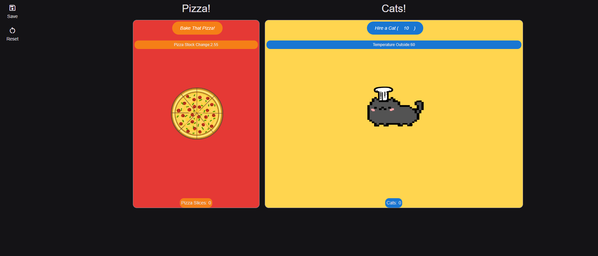

# Team Lanta presents: Catzzeria!

## Description
Welcome to the Catzzeria! In this game, you will be able to increase your Pizza Slices count with clicks initially. Once you meet the first requirement to hiring your very first cat with 10 slices of pizza, you have your first handy dandy employee that will help increase your pizza count! Moving forward, the Pizza Slices needed to hire more cats will increase every time, but each cat will help increase productivity. 

Users are also able to get the weather in Rome, Italy and check the stock price for Domino's pizza while they try to hire more cats! 

## Features
* Weather forecast in Rome, Italy - one of the best places in the world to get pizza! 
* Thinking of buying some stock anytime soon? Check out the stock price for Domino's pizza while you gather some pizza slices to hire some cats!
* Save your progress!
* Reset the game

## Languages Used
* jQuery
* AJAX
* JavaSCript
* BeerCSS
* HTML

## User Story
AS A user on the internet,
I WANT to play a silly game
SO THAT I can be entertained by funny cats making pizzas.

## Acceptance Criteria
GIVEN that I've not played before,

WHEN I first open the page,
THEN I see a big pizza button and the number 0 next to the word "pizza slices".

WHEN I click the big pizza button,
THEN the number goes up.

WHEN the number reaches 10,
THEN a new button appears with the phrase "hire a cat".

WHEN I press the "hire a cat" button,
THEN the pizza slices number subtracts by 10, and a new number appears next to the word "cats".

WHEN I have any cats hired,
THEN my pizza slice number goes up automatically every 1 second.

WHEN I try to press the "hire a cat" button without enough pizza slices,
THEN the button doesn't click.

WHEN I successfully hire a cat,
THEN the price of hiring cats goes up some amount.

## The Result
[Click here!](DEPLOYED_URL_HERE)

## Credits
- [Josh Comeau's CSS reset](https://www.joshwcomeau.com/css/custom-css-reset/)
- [Weatherbit API](https://api.weatherbit.io/)
- [FinnHub](https://finnhub.io)

## TODO (Development)
- [x] Agree on a team name!
    - [x] Change the name of the repo and any references to LANTA if is changed. 
- [x] Create skeleton of project, folder structure with js and css and images in subfolders.
- [x] "Use a CSS framework other than Bootstrap." Beer.css!
    - [x] Brainstorm some options? I don't recall any offhand.
- [x] "Be interactive (i.e.: accept and respond to user input)."
- [x] "Use at least 2 server-side API's."
- [x] "Include at least one modal, and does NOT use native browser alert, confirm, or prompt functionality."
- [x] "Use client-side storage to store persistent data."
- [x] "Be responsive." (Window size stuff, design for mobile devices first)
- [x] "Have a polished UI."
- [x] "Have a clean repository that meets quality coding standards (file structure, naming conventions, follows best practices for class/id-naming conventions, indentation, quality comments, etc.)."
- [x] Have a quality README (with unique name, description, technologies used, screenshot, and link to deployed application).
- [x] ALL OF US put a link to it in our portfolio project pages (from module 2).
